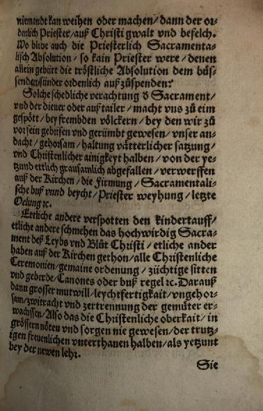
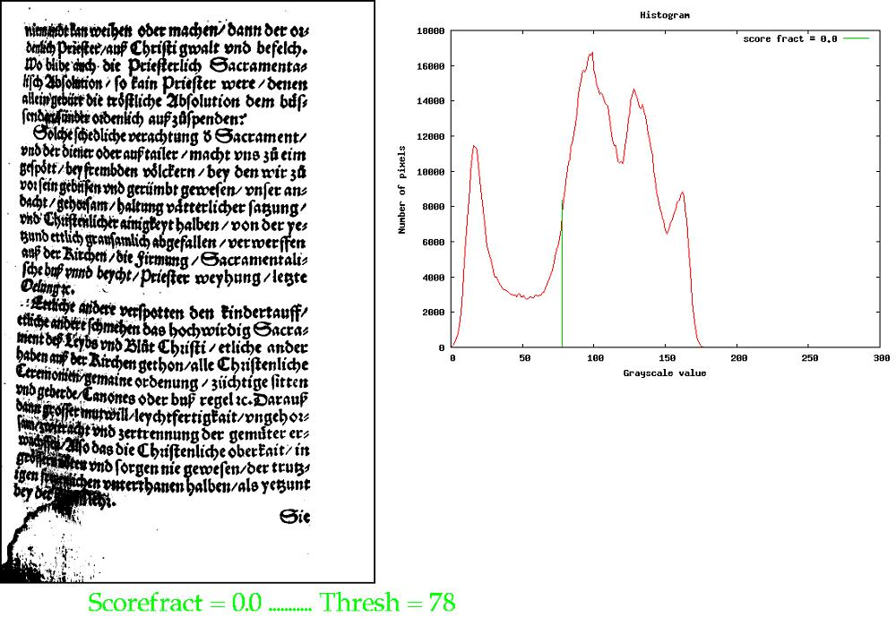
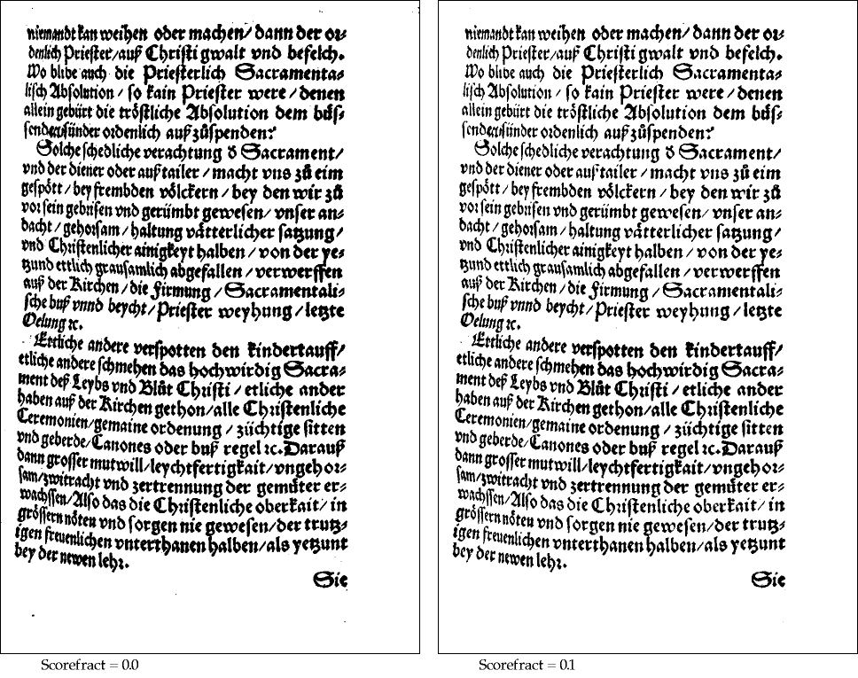

:version: $RCSfile: binarization.rst,v $ $Revision: aa1808cf90ca $ $Date: 2010/08/22 23:25:46 $

.. default-role:: fs

.. _grayscale-mapping-and-binarization:

====================================
 Grayscale Mapping and Binarization
====================================

:date: Jun 20, 2010

.. contents::
   :local:

.. _locally-adapted-grayscale-mapping:

Locally adapted grayscale mapping
=================================

Grayscale image enhancement can be global or local, and examples of both
are given :doc:`here <enhancement>`. Document images in particular can
also be grayscale enhanced as a step either for grayscale image cleanup
or as a precursor to image binarization.

However, image binarization is typically treated as simply a
thresholding operation on a grayscale image, and we give standard
global (Otsu) and local (Sauvola) thresholding operations in the
following sections. In the following, we consider operations on
document images, where text is foreground.

Several different implementations of adaptive mapping of grayscale
images are given in `adaptmap.c`. The basic method is to determine the
local background value and map the pixels linearly so that the
background is put at some constant value like 150 or 200. There are two
basic problems. The first is that there must be an actual local
background. If there is an image on the page, it will be degraded if we
try to force a background on it. So it may be important to do text-image
segmentation first and then do background mapping only on the text
parts. The second problem is to estimate the local background value. We
do this efficiently by tiling the image, identifying pixels that are
almost certainly not background, and finding the average of the
non-background pixels in each tile. We require a minimum number of such
pixels (typically about 1/3 of the pixels in the tile), and if there are
fewer, we estimate the background value in the tile based on its
neighbors. We additionally allow for smoothing between tile values,
implemented by block convolution. Once the "image" of background values
is established, the image can be mapped so the background is uniform
across the full image. The image can then be binarized by selecting a
*global* threshold that is somewhat below the background value.

A fancier adaptive mapping, ``pixBackgroundNormFlex()``, is useful for
situations where the background is changing very rapidly. It starts with
image smoothing, using a scaling factor of about 1/5 or 1/7. This is a
very cheap way to estimate the average pixel value in small tiles. A
common problem is that there is thick text that is not very dark, and it
is important not to treat the interior of such text as background. The
approach taken is to use filling of grayscale basins to a height that is
a given constant above the basin minima, and a local threshold can then
be chosen to solidify the foreground regions without corrupting the
background.

Another problematic situation is where the contrast between foreground
and backgrond is very small, so that for binarzation it is important to
choose the threshold carefully. We use a local contrast mapping,
``pixContrastNorm()``, that computes and applies a local TRC (tone
reproduction curve) to expand the local dynamic range to 8 bits, by
mapping the darkest pixels to 0 and the lightest to 255. This is useful
where the locally computed TRC function does not change rapidly with
position.

Yet another approach is to compute a local threshold over the image and
normalize the image so that the computed threshold is a constant.  This
approach is implemented with ``pixThresholdSpreadNorm()``, which starts
with a typically sparse set of estimates of the threshold value
(determined by an edge detector). The estimated values are smoothed and
then spread by a propagation method, giving a Voronoi-like result for
regions with constant threshold value.

.. _locally-adapted-binarization:

Locally adapted binarization
============================

Binarization methods that use local adaptation are given in
`binarize.c`.

.. _sauvola-binarization:

Sauvola binarization
--------------------

The Sauvola method for local binarization does quite well, and we
implement it with tiling for efficiency. The basic idea behind Sauvola
is that if the is a lot of local contrast, the threshold should be
chosen close to the mean value, whereas if there is very little
contrast, the threshold should be chosen below the mean, by an amount
proportional to the normalized local standard deviation.

Sauvola is implemented efficiently by using "integral image"
accumulators for the mean and mean-squared pixel values. The latter
requires 64 bit floating point arrays, which are expensive for large
images. Consequently, we give a tiled version. This gives the identical
results as the non-tiled method, but only requires accumulator arrays to
be in memory for each tile separately.

.. _local-backround-normalization:

Local background normalization
------------------------------

The use of a local background normalization followed by a global
threshold was discussed briefly above. Here we give a few more
details. The local estimate of the background value in the grayscale
image is used to linearly map the pixel values in such a way that the
background goes to a global constant.

There are several parameters that must be selectdd for locally-adaptive
background normalization:

#. *Tile size*. The image is tiled and the local calculation is done
   over each tile independently.

#. *Foreground threshold*. We consider all pixels at this level or
   darker to be foreground, and they are not counted when estimating the
   local background.

#. *Minimum background count*. This is used to make sure that there
   are a sufficient number of background pixels in the tile.

#. *Smoothing factors*. After local thresholds are computed, the
   result is smoothed by convolution, averaging each value by a set of
   neighbors specified by the size of the convolution kernel.

Parameter selection depends on the expected spatial dependence of the
local background. To track faster variation, it is necessary to use
smaller tiles and a smaller smoothing convolution filter. However, using
unnecessarily small tiles gives a noisier result.

.. _local-backround-normalization-with-otsu:

Local background normalization with Otsu
----------------------------------------

Image binarization using a local background normalization, followed by
a modified Otsu approach to get a global threshold that can be applied
to the normalized image. The binarization is implemented by
``pixOtsuThreshOnBackgroundNorm()``.

Local background normalization of the grayscale image is done first,
with the background being mapped to white (255). Then, to determine
the threshold that should be applied, a modified Otsu threshold is
found for the normalized image, and this is applied globally.

.. _local-backround-normalization-with-two-thresholds:

Local background normalization with two thresholds
--------------------------------------------------

After local background normalization, two different thresholds are
used. For the part of the image near the thicker text, a high
threshold can be chosen, to render the text fully in black. For the
rest of the image, much of which is background, use a threshold based
on the Otsu global value for the original image. This binarization is
implemented by ``pixMaskedThreshOnBackgroundNorm()``.

It is necessary to build a binary selection mask over the thicker or
darker text, and use it to combine the two thresholded images. This
selection mask is generated as follows. Do a second background
normalization, this time with a very small tile size. The result is to
create very light pixels in the background near significant edges.
These pixels appear as a white halo around the thicker text, and they
are extracted as a binary mask by high-pass thresholding. The mask is
then solidified over the dark text by morphological dilation.

Then to extract the thick text, a high global threshold (say, 190) is
used. The rest of the image is thresholded using a value derived from
the modified Otsu method (described above) on the *original* image.
Empirically, it is best to use a threshold value that is 30 greater
than the Otsu value, in order to recover the lighter parts of the
foreground.

Both thresholds can be applied to the standard normalized image where
the background is mapped to 255, and the resulting 1 bpp images are
combined using the selection mask.

There are many other possible variations for binarizing document
images, using locally adaptive methods, but this should give you a
feel for some of the approaches that can be used.

.. _global-binarization:

Global binarization
===================

If an image has had its background normalized to a constant value, it
can be binarized by a global value chosen to be less than the
background by an appropriate amount. It must be less because the
background cannot be made exactly constant, especially in situations
where it was changing rapidly or where there is bleedthrough from text
or image on the other side of the page.

Alternatively, some images can be binarized well with a global
threshold, and for these, one common approach is that due to Otsu. In
standard Otsu, the different possible thresholds are used on the
histogram of pixel values, and the threshold is chosen to maximize the
variance of the two pixel distributions. Specifically, a score
function is maximized that is the product of the number of pixels on
each side of the threshold times the separation of the mean values.
This works better when the ratio of the number of bg pixels to fg
pixels is not too large. However, if there are few fg pixels, the
threshold will be chosen well up the lower slope of the background
distribution, resulting in many bg pixels being thresholded to fg. We
use a modification of Otsu to moderate this effect. Instead of
choosing the threshold value to be at the maximum of the score, we
choose it to be at the minimum histogram value such that the score is
within some fraction of the maximum.

We also give a somewhat locally adapted version of Otsu, by tiling the
image (with the Pixtiling machinery) and determining the Otsu
threshold separately in each tile. Again, there is an optional
smoothing operation on the tile thresholds.

For clean images where there is not a large variation in the background
pixels, or for images that have had their background normalized (as
described :ref:`above <local-backround-normalization-with-otsu>`), Otsu
works quite well. So why the modification? This is best shown by an
example. Consider this image:

When we apply standard Otsu to this image (with scorefract = 0 in
``pixOtsuAdaptiveThreshold()``, and using large numbers for sx and sy
to guarantee a single tile over the entire image), we get a rather
poor result:

Some of the darker bg has been thresholded as fg. The origin of the
problem is evident from the histogram, where the threshold sits up on
the shoulder of the large background peak. However, by setting
scorefract = 0.1, to allow the modified Otsu to choose the minimum in
the histogram in a range where the score is within 0.9 of the maximum
value, we get this:

.. image:: figs/otsu-result-0.1.jpg
   :align: center
   :alt:  Modified Otsu with scorefract = 0.1
   :class: border

This is a significant improvement. However, notice that the text on
the right side is relatively weak.

By tiling the image (adaptive Otsu) we can do a bit better. Choosing a
tile size of 300 x 300, which must be considerably larger than can fit
into the background at the bottom of the image, one obtains a much
better result:

The result on the left is for standard (tiled) Otsu, with scorefract =
0.0, and on the right is modified (tiled) Otsu with scorefract 0.1.
For both, most of the background is now properly assigned. On the left
the text is a bit heavier throughout, and there is a small amount of
noise in the background, but with modified Otsu the text is lighter
and generally more evenly weighted.

That's about the best we can do with Otsu. When working with difficult
images, the various adaptive methods that do some type of background
normalization give better binarizations than the global methods (of
which Otsu is perhaps the best).

..
   Local Variables:
   coding: utf-8
   mode: rst
   indent-tabs-mode: nil
   sentence-end-double-space: t
   fill-column: 72
   mode: auto-fill
   standard-indent: 3
   tab-stop-list: (3 6 9 12 15 18 21 24 27 30 33 36 39 42 45 48 51 54 57 60)
   End:
